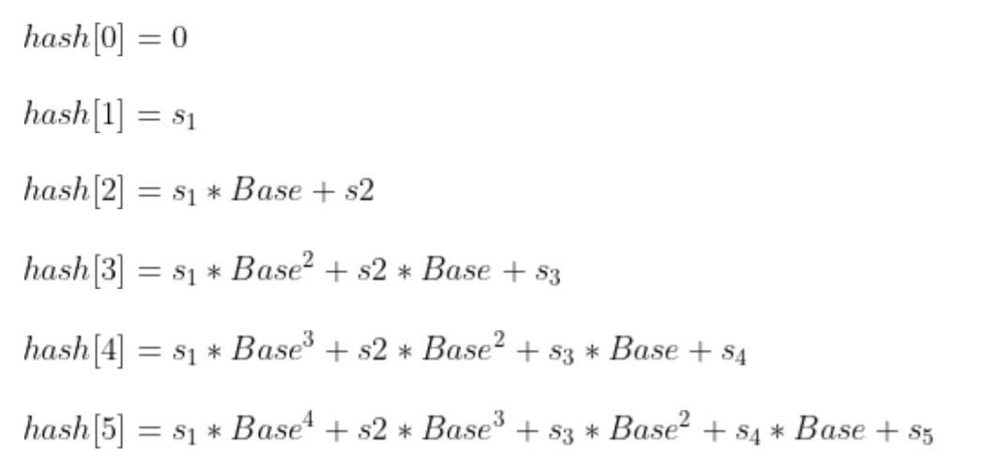

# 字符串哈希
> https://blog.csdn.net/Mikchy/article/details/103995537

hash[i]表示[0, i]字串的hash值，而p[i]表示Base的i次方\
hash[0] = 0, p[0] = 1;\
如果Base = 10，p[1] = 10, p[2] = 100\
hash[i] = hash[i - 1] * p[i] + idx(s[i])\
字符为1134\
hash[1] = hash[0] * Base + idx(s[1]) = 0 * 10 + 1 = 1\
hash[2] = hash[1] * Base + idx(s[2]) = 1 * 10 + 1 = 11\
hash[3] = hash[2] * Base + idx(s[3]) = 11 * 10 + 3 = 113\
hash[4] = hash[3] * Base + idx(s[4]) = 11 * 10 + 4 = 1134\
假设有一个S=s1s2s3s4s5的字符串，根据定义，获取其Hash值如下（我们先忽略MOD,方便理解)：\
\
现在如何求子串s3s4的hash值\
hash[4]-hash[2] * Base的2次方\
所以若已知一个S=s1s2...sn的字符串的hash值，hash[i],0≤i≤n,其子串sl..sr,对应的hash值为：\
res = hash[r]-hash[l-1] * Base的(r-l+1)次方\
res = (hash[r]-hash[l-1] * Base的(r-l+1)次方)%MOD\
上式可能为负数，所以修改为下式\
res = ((hash[r]-hash[l-1] * Base的(r-l+1)次方) % MOD + MOD) % MOD\
 

> leetcode 187.重复的DNA序列\
leetcode 1044.最长重复子串\
leetcode 1316.不同的循环子字符串\
面试题01.09.字符串轮转